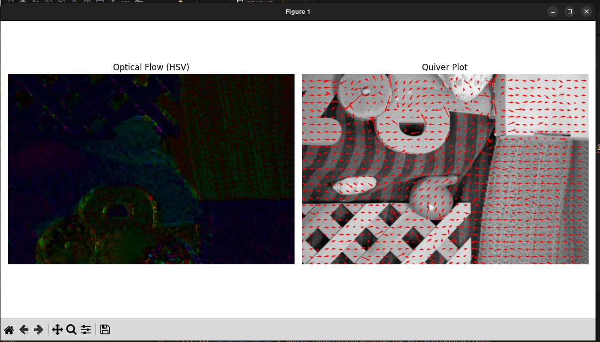
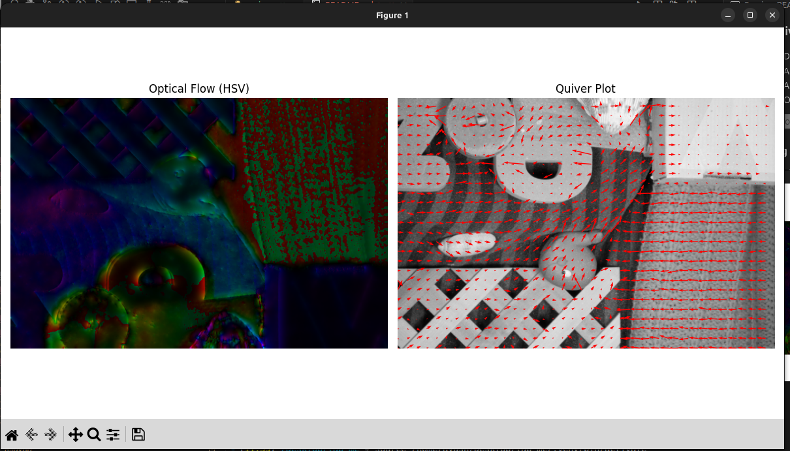

# 🌀 **Optical Flow Estimation: Lucas–Kanade & Horn–Schunck**

This Python project implements and visualizes **two classical optical flow algorithms**:

* **Lucas–Kanade (LK)** — Local optical flow estimation using least squares
* **Horn–Schunck (HS)** — Global optical flow estimation using smoothness regularization

Both methods operate on **two consecutive image frames** and generate motion field visualizations using:

* **HSV color-encoded optical flow**
* **Quiver (vector) plots**

This project is ideal for **Computer Vision labs**, **assignments**, and **motion analysis experiments**.

---

## 📘 **Algorithms Implemented**

### **1. Lucas–Kanade (Local Method)**

A local optical flow technique assuming that motion is constant within a small neighborhood.

**Key Idea:**
Solve the optical flow constraint equation using **least squares over a window**.

**Pros**

* Simple and fast
* Works well on textured regions
* Good for corners (Harris, Shi-Tomasi)

**Cons**

* Fails on flat regions (aperture problem)
* Sensitive to large motion unless pyramids are used

---

### **2. Horn–Schunck (Global Method)**

A dense, global method that minimizes a combined **brightness constancy** and **smoothness** energy functional.

**Pros**

* Produces globally smooth flow
* Works better in texture-less areas

**Cons**

* Can oversmooth object boundaries
* Higher computational cost (iterative)

---

## 📦 **Requirements**

Install dependencies:

```bash
pip install opencv-python numpy matplotlib
```

Required libraries:

* **OpenCV**
* **NumPy**
* **Matplotlib**

---

## 🚀 **How to Run**

The script requires **two sequential image frames**.

### **Syntax**

```bash
python3 main.py --images <image1_path> <image2_path> [--method <lk|hs>]
```

### **Arguments**

| Argument   | Description                                                  |
| ---------- | ------------------------------------------------------------ |
| `--images` | **(Required)** Path to frame 1 and frame 2                   |
| `--method` | Optical flow algorithm to use (`lk` or `hs`) — default: `lk` |

---

## 📝 **Examples**

### **Lucas–Kanade Optical Flow**

```bash
python3 main.py --images frame10.png frame11.png --method lk
```

### **Horn–Schunck Optical Flow**

```bash
python3 main.py --images frame10.png frame11.png --method hs
```

---

## 📊 **Output Visualizations**

Running the script displays a Matplotlib window with two subplots:

### **1. Optical Flow (HSV)**

* **Hue → motion direction**
* **Brightness → motion magnitude**
* Black = no motion
* Smooth gradients = consistent motion

### **2. Quiver Plot**

* Displays motion vectors as arrows
* Arrow direction = flow direction
* Arrow length = flow magnitude
* Overlaid on the original input frame

This provides a clear, intuitive understanding of the motion between the two frames.

### Using The Lucas–Kanade Method




### Using The Horn–Schunck Method




---

## 📁 **Project Structure**

```
├── main.py               # Main script (Lucas-Kanade + Horn-Schunck)
├── frame10.png           # Example input image (optional)
├── frame11.png           # Example input image (optional)
├── README.md             # Documentation
```

---

## 🧠 **Theory (Brief)**

Optical flow solves:

[
I_x u + I_y v + I_t = 0
]

Where

* (I_x), (I_y) → spatial gradients
* (I_t) → temporal gradient
* (u, v) → horizontal and vertical motion

Both LK and HS rely on assumptions:

* **Brightness constancy**
* **Spatial smoothness of motion**

---

## 🎓 **Use Cases**

* Computer Vision Lab Assignments
* Motion Tracking
* Video Stabilization
* Robot Navigation
* Optical Flow Learning

---

## 🤝 **Contributions**

Feel free to open issues or submit pull requests!

---
